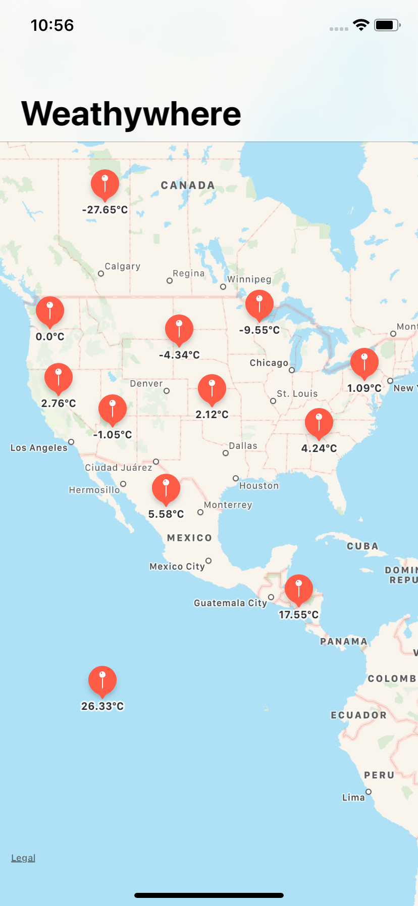

# Weathywhere
Weathywhere is a simple iOS app. The user can tap and hold a location on the map to see the weather at that location. It uses the [open weather map](https://openweathermap.org) API to fetch the information.

## What I learned
* MapKit
* APIs
* SwiftyJSON

## What I used
* Swift
* UIKit
